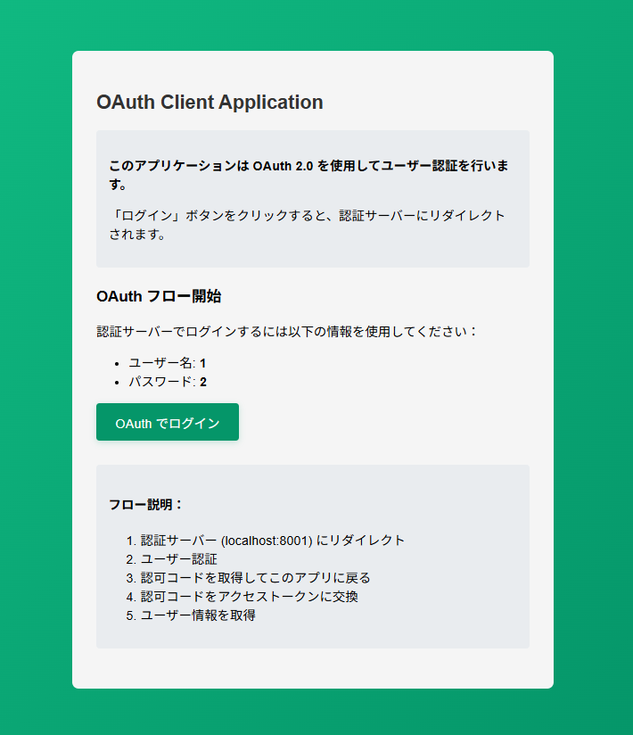
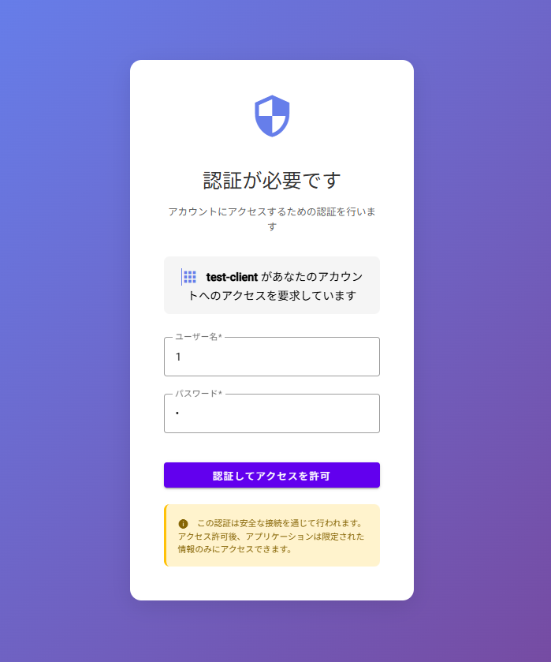
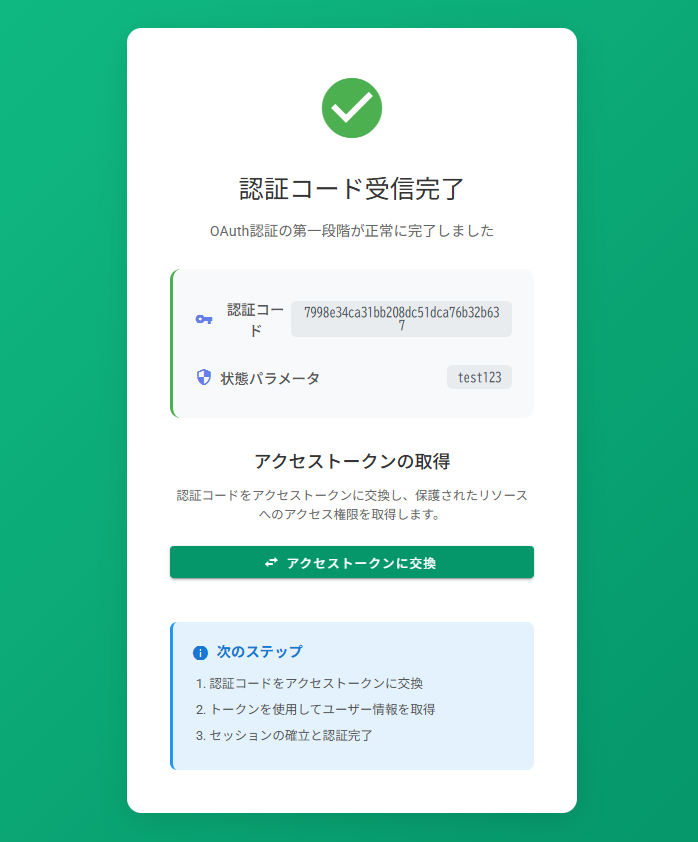
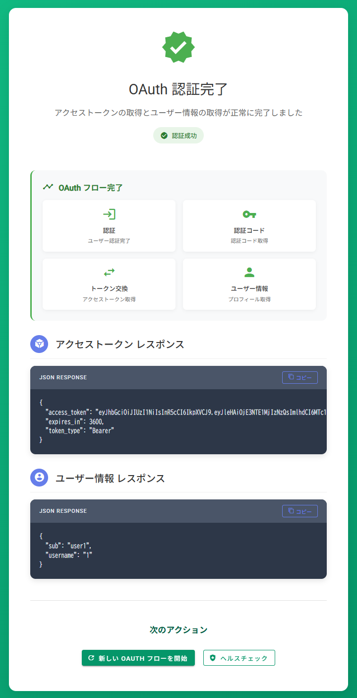

# プロジェクトの概要説明
OAuthの理解を踏まえるために最小限の実装を行いました。<br>
あくまでも学習用のためRFC6479に準拠しておらず、PKCEやOpenID Connectにも対応していません。<br>
※参考
- [RFC6479](https://datatracker.ietf.org/doc/html/rfc6749)
- [OpenID Connect](https://solution.kamome-e.com/blog/archive/blog-auth-20221108/)
- [PKCE](https://qiita.com/ist-n-m/items/992c67b803ff460818ec)
## 言語
* Go1.24
## 環境構築
* Docker
* DevContainer
# 環境構築手順
クライアントと認可サーバーの２つを構築する必要があります。
### 1. コンテナ間通信の準備を行う
```
docker network create oauth-network
```
### 2. クライアントと認可サーバーを構築する
 下記のブランチで、[こちら](./docs/VsCodeDevContainer.md)の手順で環境構築をしてください。
 同じ手順でそれぞれ別で作成してください。<br>
 ※今回別サーバーであることを明確にしたかったため、あえてコンテナを分けています。
 - ブランチ名1
 - ブランチ名2
### 3. コンテナ間通信の設定を行う
私の環境だとconnectしないと反映されなかったので、以下のコマンドで対応しました。
```
docker ps

docker network connect oauth-network oauth_practice_devcontainer-go-1
docker network connect oauth-network oauth_client_practice_devcontainer-go-1
```
# 動作確認手順
## 1. http://localhost:8002/loginにアクセス
## 2. ログイン画面のOAuthでログインを押下

## 3. ユーザー名とパスワードを入力
| 項目 | 値 |
| ---- | ---- |
| ユーザー名 | 1 |
| パスワード | 2 |


## 4. アクセストークンに交換を押下

## 5. 認可サーバーから情報が取得できていることを確認

